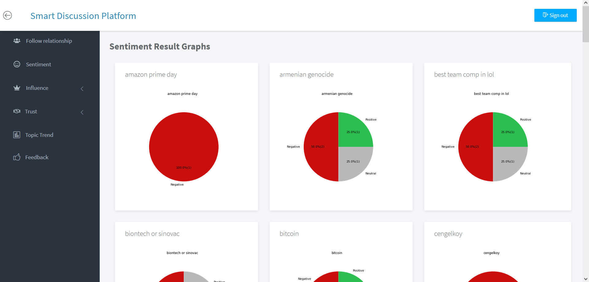

# Smart Discussion Platform

Smart Discussion Platform allows people to discuss topics and also allows administrators to rule and analyze the system in terms of trends, influence, trust issues by Machine Learning
and Natural Language Processing Techniques.

## Website Link

http://smartdiscussionplatform.com/

## User Interface

### Index Page

This is the first page of the website. On the left we can see the hot topics or trend topics that 
people are talking about. The ranking is done by using the trend algorithm. On the right, there is a quick slide that summarizes the functionalities and
the purpose of the website.

### Main Page

When a user clicks on a topic title from the Hot topics list, the user can see the comments, likes and dislikes and other details about that topic on the main page.

### Profile Page

At the top of the profile page it can be seen the summary of the user activities.
On the right of that, there is a follow button that the user can follow or unfollow 
that user and at the bottom the user can see all the information in details about that
user.

### Feeds Page

In this page the users can see their 
following user's comments in the main page. Hence, they will not miss any information
about them.

## Admin Interface

### Follower Relationship Page

### Sentiment Page

Sentiment analysis for each comment topic by topic.

### Influencer Page

Most influencer users

### Trust Page

Most trustable users

### Trend Page

Trend scores of each topic time by time

### Developers 
- Mert Can Çakmak
- Bedirhan Gergin

